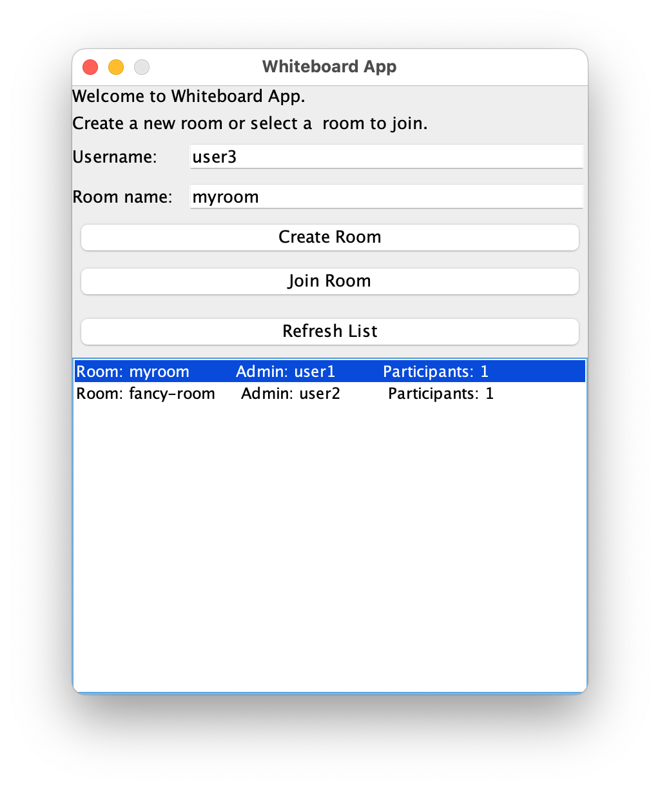

# RMI-Shared-Whiteboard
A multi-room shared whiteboard application implemented by Java RMI.

## **Introduction**

This software suite presents a **collaborative whiteboard application**, developed using **Java Remote Method Invocation (RMI)** and a client-server architecture. The application takes on the role of a server upon room initiation by a user, allowing other participants to engage as clients by joining the created room. It boasts an array of functional capabilities, including real-time sketching, a live chatroom, room history preservation, canvas export features, and comprehensive participant management.


## **Table of Content**

{:toc}

## **Features**

The application allows users to create and join remote room, perform drawing on a whiteboard and chat together without noticeable delay. The application also support participants management and room data import and export. Detailed features are stated asa below:

1. **As a Room Administrator**, a user:
   1. Has the ability to instantiate a room.
   2. Can respond to requests for room participation.
   3. Can dismiss a participant from a room.
   4. Can conclude the meeting in a seamless manner.
   5. Can access, save, and duplicate the current drawings and chat history.
   6. Can clear the whiteboard.
2. **As a Room Participant**, a user:
   1. Can issue a request to join a room.
   2. Can become part of a room.
   3. Can exit the room without disruption.
3. **Universal User Features** (applicable to both administrators and participants):
   1. Can discover all available rooms.
   2. Can view all active users in the room.
   3. Can identify users who have disconnected from the room.
   4. Can select and draw various shapes on the canvas, including circles, lines, ovals, rectangles, text and freehand shapes.
   5. Can set different colours for the shapes drawn.
   6. Can adjust the stroke width of the shapes drawn.
   7. Can choose whether to display the author's label on each drawing.
   8. Can contribute to the room's chat conversation.
   9. Can export the current canvas to an image format.

### 

## **Run the application**

### Start registry

1. Given in the repo directory, `cd` to classes directory

   ```sh
   cd sharedWhiteBoard/target/classes
   ```

2. Start RMI registry

   ```bash
   registry
   ```

   By default, the RMI registry uses port `1099`. But we can also set to another port.

   e.g. 

   ```bash
   registry 8000
   ```

### Start application

1. Given in the repo directory, `cd` to where the jar file is located

   ```bash
   cd jar
   ```

2. Start application

   ```sh
   java -jar RMISharedWhiteboard.jar
   ```

   By default, the application will get registry from host `localhost` and port `1099`. If the registry is started at different host or port, the host and port should be provided to the application.

   e.g. 

   If the registry is started at `localhost` with port `8000`, we can start the application by executing:

   ```sh
   java -jar RMISharedWhiteboard.jar localhost 8000
   ```

If succeed, the application GUI should pop up at the center of the screen. If failed, which is usually due to failures of connecting to RMI registry, error message would be displayed.

```sh
> java -jar RMISharedWhiteboard.jar localhost 8000
June 24, 2023 10:33:57 PM logger.WhiteboardLogger error
SEVERE: Failed to connect to registry.
```


## Demo

**(Video demo not yet ready)**




